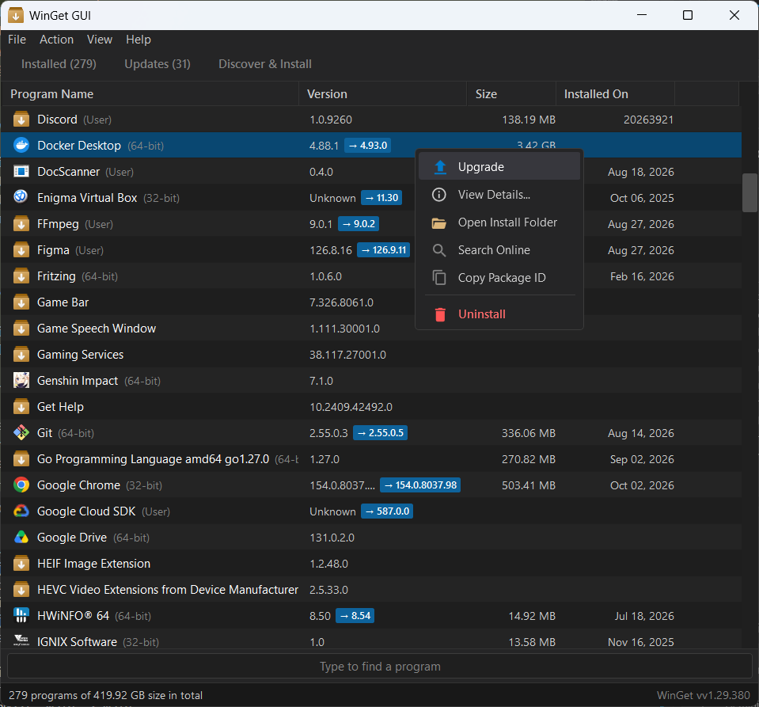

# WinGet GUI

A desktop graphical interface for the Windows Package Manager (`winget`) built with .NET 8 and WPF to manage, update, search, and install Windows software packages.



---

## Features

- **Hybrid Data Aggregation**: Combines `winget` package tracking with Windows Add/Remove Programs (ARP) registry records to report accurate disk footprint sizes (`EstimatedSize`), installation dates (`InstallDate`), install locations, and native application icons.
- **Package Management & Operations**: Upgrade, uninstall, or reinstall software packages individually or in batch with instant feedback.
- **Update Visibility Control**: Hide unwanted or pinned updates from the upgrade queue with dedicated context actions, and toggle visibility of hidden items directly from the menu.
- **Multi-Tab Organization**:
  - **Installed Programs**: Inspect installed desktop and Store applications, view architectures (`x64`, `32-bit`), footprint sizes, and available upgrades.
  - **Available Updates**: View and apply available package updates individually or in batch.
  - **Discover & Install**: Search the global Windows Package Manager repository and install packages directly.
- **Instant Search Filtering**: Real-time filtering across package name, publisher, version, and package ID directly from the search bar or dedicated shortcut.
- **Live Operation Console**: Integrated slide-up console drawer streaming real-time stdout/stderr from package manager commands without blocking application workflows.
- **Data Export**: Export package lists and system inventories to CSV or text formats.

---

## Requirements

- **Operating System**: Windows 10 (Build 17763+) or Windows 11
- **Runtime**: [.NET 8.0 Desktop Runtime](https://dotnet.microsoft.com/download/dotnet/8.0)
- **Package Manager**: [Windows Package Manager (`winget`)](https://github.com/microsoft/winget-cli) (pre-installed on Windows 10/11)

---

## Keyboard Shortcuts

| Shortcut | Description |
| :--- | :--- |
| `F5` | Refresh package catalog and update status |
| `Ctrl + F` | Focus quick search filter input |
| `Escape` | Clear search filter and return focus to list |
| `Ctrl + 1` | Switch to Installed Programs tab |
| `Ctrl + 2` | Switch to Available Updates tab |
| `Ctrl + 3` | Switch to Discover & Install tab |
| `Enter` | View comprehensive package details |
| `Delete` | Uninstall selected package |
| `Ctrl + U` | Upgrade selected package |
| `Ctrl + O` | Open installation directory in Windows Explorer |
| `Ctrl + C` | Copy package ID to clipboard |
| `Ctrl + E` | Export package list to CSV or TXT |

---

## Building and Running

### Prerequisites
- [.NET 8.0 SDK](https://dotnet.microsoft.com/download/dotnet/8.0)

### Build Application
```powershell
dotnet build -c Release
```

### Run Application
```powershell
dotnet run -c Release
```

### Self-Contained Publishing (x64)
To produce a portable standalone folder that does not require a pre-installed .NET runtime on target machines:
```powershell
dotnet publish WingetGui.csproj -c Release -r win-x64 --self-contained true -o ./publish /p:PublishSingleFile=false
```

---

## Project Structure

```
winget-gui/
├── assets/
│   ├── app.ico               # Application executable icon
│   ├── app.png               # High-DPI application branding logo
│   ├── image.png             # Application interface preview
│   └── winget_logo.svg       # Vector logo asset
├── App.xaml                  # Application entry point and theme resource definitions
├── App.xaml.cs               # Application code-behind
├── MainWindow.xaml           # Primary window layout, menus, list views, and console drawer
├── MainWindow.xaml.cs        # Primary window interactions and shortcut bindings
├── WingetGui.csproj          # .NET 8.0 WPF project definition
├── app.manifest              # PerMonitorV2 High-DPI declaration
├── Converters/
│   └── CommonConverters.cs   # XAML value converters for UI visibility and bindings
├── Models/
│   └── PackageItem.cs        # Observable data model for installed and available packages
├── Services/
│   ├── IconService.cs        # Win32 shell icon extraction and caching engine
│   ├── RegistryService.cs    # Windows Add/Remove Programs (ARP) registry scanner
│   └── WingetService.cs      # Asynchronous CLI runner and output stream parser
└── ViewModels/
    └── MainViewModel.cs      # Primary application state, commands, and catalog filtering
```
